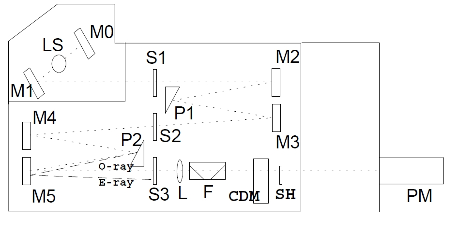

 Introduction to a general layout of a spectrometer

The basic CD spectrometer design most widely adopted by the leading manufacturers comprises a high intensity broadband light source (usually a high pressure Xenon arc lamp), a double prism monochromator which not only serves to disperse the wavelength but is also used to linearly polarise the light beam, an electro-optic modulator which transforms the linearly polarised light into circularly polarised states, a sample chamber and photomultiplier detector. Sophisticated control and signal processing electronics, all under PC control, completes a typical instrument (Figure below)

Block diagram of a spectropolarimeter. Plane polarised radiation is produced by passage of light from the source (LS) through 2 prisms (P1 and P2) and a series of mirrors (M0 to M5) and slits (S1 to S3). The ordinary ray (O) is focussed by a lens (L), and passed through a filter (F) to the modulator (CDM). The circularly polarised components are then passed through the shutter (SH) to the sample compartment, before detection by the photomultiplier (PM). (E represents the extra-ordinary ray).

**LS** light source, is a 150W, air cooled Xe lamp, with quartz envelope. It emits a strong continuous spectra in the all wavelength range of the monochromator (163-1100 nm)

**M1** is an elliptical mirror focusing the lamp arc on the entrance slit (S1) of the double monochromator

**M0** is the mirror to collect back-emitted radiation from the source

**S1,S2,S3** are the entrance, intermediate and exit slits of the monochromator, all linked together

**M2-M5** are the spherical collimator mirrors of the double monochromator (Czerny Turner type)

**P1,P2** are the quartz prisms of the monochromator, prisms are used to disperse radiation and also to get linear polarization output. E-ray (extraodinary ray with crossed polarization) is not getting out

**L** is the focusing lens to get beam collimated in the sample compartment

**F** is a series of 45o quartz plates to clean further the monochromatic exit beam polarization

**CDM** is the photoelastic modulator crystal in its thermostatted housing, it acts (in CD mode) as a 1/4 wave achromatic plate, i.e. the linear polarized beam is deflected + and - 45oX at the crystal oscillation frequency (50 KHz)

**SH** is a mechanical shutter to remove radiation from sample (when needed)

**PM** is the photomultiplier tube detector

=> As white light passes through the first prism it is split into its component wavelengths and the wavelength selected by the intermediate slit.  
=> The prism also separates the linear polarised components of light. The pointed ray is the vertically polarised component and the semi-solid ray is the horizontally polarised component  
=> What actually passes through the intermediate slit is a mixture of horizontally polarised light of the selected wavelength and vertically polarised light of different wavelength.  
=> The second prism separates out the contaminating vertically polarised beam, as well as straylight that has made it through the first monochromator.  
=> The unique combination of the two polarising quartz prisms provides a wide separation of polarised components, allowing wider slit widths, so more light, to be used.  
=> The polarised light is passed through a photoelastic modulator(CDM) which converts the beam into alternating left and right circularly polarised light.  

**Polarisation modulation**

The measurement of CD requires the generation of a monochromatic probe light beam in each of the left circularly polarised (CPL) and right circularly polarised (CPR) states and a means of detecting the difference in absorbance of the two states caused by the introduction of a sample into the light beam. The differential absorbance of a typical sample with respect to the two circularly polarised states is typically in the order of 1 part in 104 or less. Therefore the differences to be measured in the CPL and CPR photometric signals are also of this order in relation to the transmission background of the sample. The most reliable mechanism developed to date for measuring such fine differences in sample absorbance utilises a modulation technique whereby the light beam from the monochromator is alternately switched at a high frequency (typically 50 kHz) between the CPL and CPR states using a photo-elastic modulator (CDM). Following transmission through the sample, the beam strikes a photomultiplier detector which converts the incident photon flux to a photometric current.Any sample CD results in a small 50 kHz AC component superimposed on a much larger DC background resulting from the standard transmission of the sample. This AC amplitude is detected using a tuned amplifier and demodulation circuit and the CD is derived from the ratio of the AC and DC amplitudes. This optical modulation approach has the benefit of allowing sensitive detection in a single channel and also inherent rejection of noise and drift away from the modulation frequency.

**Initialization of the CD spectrometer**

**(1)Purging the instrument with N2:**
The need to measure very small signals in the far-UV has been the biggest influence driving improvements in instrument specification over the years and significant increases to the limit of detection and far-UV performance have been achieved. Specifically, the most critical requirement for all CD instruments is to maximise the intensity and quality of circularly polarized light available, particularly in the far-UV, down to what is the experimentally practical limit of 170-175 nm. 190 nm and below is the most demanding region of the spectrum in which the instrument must operate. At this wavelength the instrument must be purged with high-purity oxygen-free nitrogen (approx 3-V5 L min) for at least 20 min before starting the light source and while making measurements. Any oxygen present may be converted to ozone by far-UV light from the high intensity arc, and ozone will damage optical surfaces. Higher nitrogen flow rates should be used for measurements below 190 nm.

**(2)Controlling the temperature of the sample:External water bath and Peltier temperature control**  
Accurate and repeatable temperature control of the sample is a crucial need for any spectrometer system and even more important with CD due to the heavy use in measurement of biomolecules. In the CD spectrometer generally the circulator water bath(temperature range 20-200oC) based peltier temperature control system is used to control the the temperature of sample placed inside the cell. The Peltier thermostatted cell holder which enables temperature control using the temperature control program. It controls the sample temperature to measure the CD spectrum with change in temperature, generally in the range of -10 to +110oC.

Peltier cooling attachment is based on the Peltier effect(The Peltier effect occurs whenever electrical current flows through two dissimilar conductors(or metals). Depending on the direction of current flow, the junction of the two conductors will either absorb or release heat.)

Cooling, Heating: When DC voltage is applied to the module, the positive and negative charge carriers in the pellet array absorb heat energy from one substrate surface and release it to the substrate at the opposite side. The surface where heat energy is absorbed becomes cold; the opposite surface where heat energy is released, becomes hot. Using this simple approach to "heat pumping," thermoelectric technology is applied to many widely-varied applications-small laser diode coolers, portable refrigerators, scientific thermal conditioning, liquid coolers, and beyond.

Schematic of a simple Peltier cooler (Source:See Ref:6b)

The ability to measure CD spectra while controlling the temperature of a sample offers important information about conformational change associated with temperature and is used in the study of biopolymers. The temperature control program measures the thermal denaturation curve (temperature scan) and CD spectra during temperature change based on user selected parameters.

**(3)Solution preparation for CD spectrum measurement**

**(i)Selection of protein:**
Samples should, of course, be of he highest possible purity. Near-UV CD signals, in particular, can be seriously distorted by the presence of relatively small amounts of protein impurities (if they have intense signals) and by the presence of nucleic acids, which have intense CD bands in this region.
The protein should be free from other aggregates, as aggregated proteins can cause optical artefacts in CD such as differential light scattering and absorption flattening.

Far-UV CD spectra of proteins (260-V178 nm) are intense and small amounts of material are required to record them. Because all peptide bonds contribute to the spectrum the amount of material required is effectively the same for any protein. Typical quantities are 200 μL of a 0.1- 0.15 mg/mL solution with a 1-mm path length cuvet or 30 £gL of a 1.0-1.5 mg/mL solution with a 0.1 mm (demountable) cuvet. The latter is preferable for good far-UV penetration but the material is not generally recoverable.

Near-UV CD spectra (340-255 nm) are much less intense than far-UV spectra and recording them requires more material. Spectra are usually recorded under conditions similar to those used for measuring a conventional absorption spectrum, e.g., use a 10-mm cuvet and aim for an absorbance at 280 nm in the range 0.7-1.0. Less-concentrated solutions may be used if the CD signals are intense.

CD signals will be seriously distorted if too little light reaches the photomultiplier. In practical terms, this means that one cannot make reliable measurements on samples with an absorbance (sample plus solvent) much greater than 1. The absorption spectrum of the sample should always be checked to see if this absorbance limit is exceeded. In far-UV measurements, the absorbance of the protein itself is generally rather small and the major problems arise from absorption by buffer components, almost all of which will limit far-UV penetration to some extent.

**(ii)Selection of Solvent/buffer:**
The aim in recording CD spectra of good quality is to keep overall absorbance within reasonable bounds(less than 1). If the absorbance will be too high then the relatively small photon flux reaching the detector will lead to high errors in measuring the small values of absorbance and will generate high levels of noise relative to signal. Therefore to obtain better results the concentration of sample must be kept high as to that of the solvent system. It may also be necessary to maintain the ionic strength of the sample and to add reducing or chelating agents to improve the stability of protein. Oxygen absorbs light below 200 nm; for optimum transparency, buffers should therefore be prepared with glass-distilled water or the water should be degassed before use.

It is essential to run a blank spectrum with buffer or solvent system alone in order to check that the absorbance and High Tension voltage is not excessive. If that happens then it may be possible to use cells of shorter path length, provided that the concentration of sample can be increased or lower teh concentration of species which is causing problem(e.g. Chloride ions). Selection of buffer provides denaturation of proteins and peptides. The buffers also show cutoffs at a certain point in low wavelength region where they start to absorb after certain point, therefore cutoff values of certain common buffers should be known. Use of optically active buffers should be avoided as it can provide inaccurate results. Therefore clear solutions are required and CD is taken in high transparency quartz cuvettes to ensure least interference.

Buffer components (especially those that contain carboxylates) that have a high absorbance below 200 nm must be avoided (e.g. Tris [tris(hydroxymethyl)aminomethane], dithiothreitol, imidazole, histidine, choloride, etc.). The following table describes the cutoff wavelength (wavelength in which absorbance = 1 for a 1 mm cuvette) for common solvents and buffer components. Cuvettes with short pathlengths are better, since the amount of buffer the light travels through is minimized. The disadvantage of short pathlength cuvettes is the higher concentration of protein which must be used (increased 10-fold relative to a 1 cm cell). Ideally, the buffer concentration is low (< 10 mM).
Cutoff Wavelengths For Common Solvents and Buffers

|Solvent System        |Cut off (nm)*|
|----------------------|-------------|
|Water                 |   <185      |
|Trifluoroethanol      |   <185      |
|Hexafluoroisopropanol |   <185      |
|Acetonitrile 	       |   185       |
|Methanol 	       |   195       |
|Ethanol 	       |   196       |
|2-Propanol 	       |   196       |
|Cyclohexane 	       |   <185      |
|Dioxane 	       |   232       |
|(NH4)2SO4 0.15 M|   191       |
|NaCl 0.15 M 	       |   196       |
|NaClO4 0.15 M|   <185      |
|NaNO3 0.15 M 	       |   245       | 
|Phosphate 100 mM      |   <185      |
|Tris 100 mM 	       |   195       |
|Pipes 100 mM 	       |   215       |
|Mes 100 mM 	       |   205       |
|GdnHCl 4 M 	       |   210       |
|Urea 4 M 	       |   210       |

* For a one mm path length

(Source:See Ref:4)

Absorption properties of selected buffer components in the far UV
Absorbance (50 mM solution in 0.02 cm pathlength cell)  
|Buffer   component           |	180nm |	190nm |	200nm |	210nm|
|-----------------------------|-------|-------|-------|------|
|NaCl                         |	>0.5  |	>0.5  |	0.02  | 0    |
|NaF                          |	0     | 0     | 0     | 0    |
|Na borate(pH 9.1)            |	0.3   |	0.09  | 0     | 0    |
|Na2HPO4|	>0.5  | 0.3   | 0.05  | 0    |
|NaH2PO4|	0.15  | 0.01  | 0     |	0    |
|Na acetate                   |	>0.5  | >0.5  | 0.17  | 0.03 |
|Tris/H2SO4(pH 8.0)| 	>0.5  | 0.24  |	0.13  |	0.02 |
|HEPES/Na+ (pH 7.5)| 	>0.5  | >0.5  |	0.5   | 0.37 |
(Source:See Ref:5)

Chloride and carboxylate ions absorb strongly below 195nm. Therefore high concentrations of chloride ions arising from Tris/HCl buffers should be avoided and instead flouride and sulphate ions can be used to maintain ionic strength. Buffers based on phosphate, borate or Tris are suitable for maintaining pH values in range from about 6.5-9.5 and buffers in pH range 4 to 6 are usually based on carboxylate groups or sulphonic acid derivatives and can only be used at low concentrations(<10mM). Organic solvents are used while dealing with very non-polar integral membrane proteins(generally in case of natural products or drugs).

**(iii)Sample concentration to be used**
Solutions should be prepared according to the pathlength of cuvette
|Cuvette path(cm)| Concentration of sample(mg/ml)|
|----------------|-------------------------------|
|0.01-0.02 	 |0.2-1.0                        |
|0.1 	         |0.05-0.2                       |
|1 	         |0.005-0.01                     | 

(Source:See Ref:3)

The most accurate method of determining protein concentration is quantitative amino acid analysis, using the concentrations of the stable amino acids, e.g. alanine and lysine to calculate the concentration of the intact protein. This method is very sensitive and can be performed on actual CD samples. Concentration can be determined using published molar extinction coefficients if they are available; the protein should be dialyzed or desalted into the CD buffer immediately before the spectrum is obtained and filtered though 0.1 to 0.2 micron filters to reduce light scattering. The spectrum of the CD buffer alone must be subtracted from the spectrum of the sample. Since CD is usually carried out on samples with relatively low concentrations, it is best to prepare a filtered stock solution of the protein of ~1 mg/ml in the CD buffer and determine its protein concentration and dilute the stock for the CD measurements. It is important to thoroughly dry the cuvette before using as water droplets in cuvette can alter the concentration of the sample.

**(iV)Calibration of cell Pathlength**
The cells used for CD work should be manufactured to extremely high standards. Suprasil(quartz) is generally used for measurements. Refillable cells are available commercially with pathlengths in the range 0.01 to 10cm. Shorter pathlength calls (0.001cm or even shorter) are of demountable type consisting of 2 quartz plate and one of them is prepared to required depth.
The path lengths can be established either on the basis of interference patterns caused by reflection of incident light from internal surfaces of the cells or on the absorbance of standard solutions. High transparency quartz cuvettes (cells) are used in CD spectrometer. Generally two types of cells are used, rectangular and cylindrical cells with path lengths ranging from 0.01 to 1 cm. Water jacketed cylindrical cells are available for CD machines that do not have temperature regulated cell holders. Rectangular cells with path lengths less than 0.1 cm often have a very small total sample volume and a very small surface area facing the light beam of the CD machine. It is important that the light beam should properly focus when these cells are used, since large artifacts are produced if the light does not go directly through the sample. In the near-UV region where path lengths from 1 mm down to 0.01 mm are required rectangular cells, in their standard, semimicro, or micro forms, are normally used. These are more economical than the cylindrical type, and allow mixing to be carried properly. For far-UV CD spectra, short-path-length cells from 1 mm down to 0.01 mm are necessary because of the higher absorbance and ellipticity in this region.
